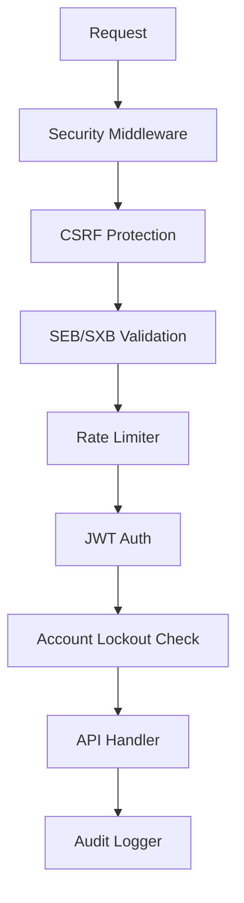
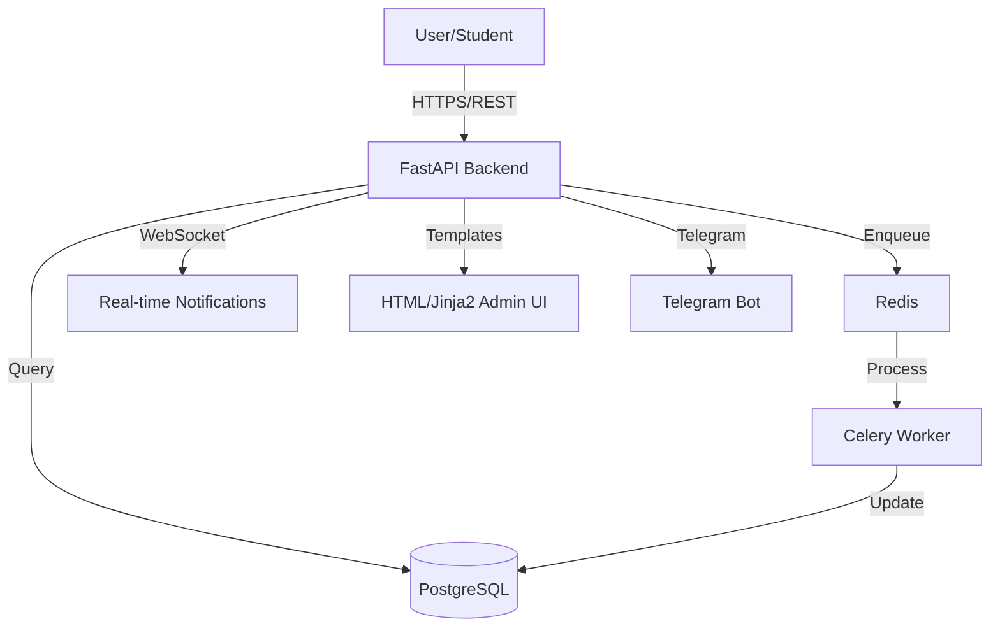

# Ujian Online Jules Up5 V1 — Architecture

> A high-performance, production-grade online examination platform with a FastAPI backend, Flutter mobile client, and enterprise security features.

---

## 📋 Overview

Enterprise-grade online examination system designed for reliability, security, and scale. Built on FastAPI for the backend API and Flutter for the client application. Uses PostgreSQL for persistent storage, Redis/Celery for asynchronous task processing. Includes a robust SEB (Safe Exam Browser) integration, real-time WebSocket notifications, PDF generation, analytics, and Telegram alerting.

---

## 🏗️ Directory Structure

```plaintext
/
├── app/                              # FastAPI Backend Application
│   ├── api/                          # Route handlers (30 endpoint modules)
│   │   ├── auth.py                   # JWT authentication & token management
│   │   ├── exams.py                  # Core exam CRUD & session management (115KB)
│   │   ├── users.py                  # User management & bulk upload
│   │   ├── questions.py              # Question bank management
│   │   ├── grading.py                # Answer grading & result processing
│   │   ├── analytics.py              # Exam analytics & statistics
│   │   ├── monitoring.py             # System health monitoring
│   │   ├── backup.py                 # Backup/restore endpoints
│   │   ├── media.py                  # File/media upload handling
│   │   ├── notifications.py          # Push notification management
│   │   ├── seb_builder.py            # SEB config builder endpoints
│   │   ├── seb_autoconfig.py         # Safe Exam Browser auto-configuration
│   │   ├── security_analytics.py     # Security event analytics
│   │   ├── system_settings.py        # Admin system configuration
│   │   ├── telegram_admin.py         # Telegram bot admin commands
│   │   ├── websocket.py              # Real-time WebSocket endpoints
│   │   ├── account_security.py       # Account lockout & security
│   │   ├── activity.py               # User activity logging
│   │   ├── alerts.py                 # System alerts management
│   │   ├── apk.py                    # APK build & distribution
│   │   ├── exam_admin.py             # Admin exam management
│   │   ├── exam_seb.py               # SEB-specific exam controls
│   │   ├── metrics.py                # Prometheus metrics exposure
│   │   ├── scheduled.py              # Scheduled task management
│   │   ├── stats.py                  # Dashboard statistics
│   │   ├── subjects.py               # Subject/category management
│   │   ├── sxb.py                    # SXB (custom SEB) integration
│   │   ├── templates.py              # Exam template management
│   │   └── upload.py                 # File upload utilities
│   ├── core/                         # Core application modules (22 files)
│   │   ├── security.py               # JWT, password hashing, token validation
│   │   ├── token_service.py          # Token lifecycle management
│   │   ├── cache.py / cache_manager.py  # Redis caching layer
│   │   ├── rate_limiter.py           # API rate limiting
│   │   ├── account_lockout.py        # Brute-force protection
│   │   ├── captcha.py                # CAPTCHA integration
│   │   ├── seb.py                    # SEB protocol validation (17KB)
│   │   ├── sxb_security.py           # SXB security enforcement
│   │   ├── audit_logger.py           # Security audit trail
│   │   ├── security_logging.py       # Structured security events
│   │   ├── alerting.py               # Multi-channel alerts (Telegram)
│   │   ├── error_handlers.py         # Global exception handlers
│   │   ├── sanitization.py           # Input sanitization
│   │   ├── metrics_collector.py      # Prometheus metrics collection
│   │   ├── pdf_generator.py          # PDF report generation (13KB)
│   │   ├── irt_analysis.py           # Item Response Theory analysis (10KB)
│   │   ├── query_optimizer.py        # DB query optimization helpers
│   │   ├── redis_pubsub.py           # Redis pub/sub messaging
│   │   ├── structured_logging.py     # Structured log formatting
│   │   └── performance_monitoring.py # Performance metrics
│   ├── middleware/                   # ASGI Middleware stack (8 files)
│   │   ├── security.py               # Security headers & HTTPS enforcement
│   │   ├── csrf_protection.py        # CSRF token validation
│   │   ├── seb_validation.py         # SEB request validation (10KB)
│   │   ├── sxb_enforcer.py           # SXB protocol enforcement (9KB)
│   │   ├── logging_middleware.py     # Request/response logging
│   │   ├── performance.py            # Response time tracking
│   │   └── performance_monitoring.py # Middleware performance metrics
│   ├── models/                       # SQLAlchemy database models (19 files)
│   │   ├── user.py                   # User accounts & roles
│   │   ├── exam.py                   # Exam definitions & config (4KB)
│   │   ├── question.py               # Question bank (13KB)
│   │   ├── session.py                # Exam sessions & submissions (5KB)
│   │   ├── notification.py           # Notification records
│   │   ├── security_event.py         # Security audit events
│   │   ├── activity_log.py           # User activity records
│   │   ├── scheduled.py              # Scheduled job records
│   │   ├── seb_config_template.py    # SEB configuration templates
│   │   ├── seb_build.py              # SEB build artifacts
│   │   ├── apk_build.py              # APK build records
│   │   ├── tag.py / category.py      # Question taxonomy
│   │   ├── subject.py                # Academic subjects
│   │   ├── media.py                  # Uploaded media records
│   │   ├── refresh_token.py          # JWT refresh tokens
│   │   └── exam_template.py          # Reusable exam templates
│   ├── schemas/                      # Pydantic validation schemas (10 files)
│   │   ├── exam.py                   # Exam DTOs (11KB)
│   │   ├── answer.py                 # Answer submission schema (7KB)
│   │   ├── question_bank.py          # Question bank DTOs
│   │   ├── user.py                   # User DTOs
│   │   ├── common.py                 # Shared schemas (3KB)
│   │   ├── template.py               # Template schemas
│   │   └── scheduled.py              # Scheduled task schemas
│   ├── services/                     # Business logic layer
│   │   └── exam_service.py           # Core exam business logic (3KB)
│   ├── tasks/                        # Celery background tasks (4 files)
│   │   ├── answer_processor.py       # Async answer grading (7KB)
│   │   ├── scheduler.py              # Celery beat scheduler (11KB)
│   │   └── views_refresher.py        # DB materialized view refresh
│   ├── utils/                        # Utility modules (5 files)
│   │   ├── telegram_alerts.py        # Telegram notification sender (8KB)
│   │   ├── telegram_utils.py         # Telegram bot utilities
│   │   ├── apk_validation.py         # APK file validation (10KB)
│   │   └── seed_presets.py           # Data seeding utilities
│   ├── database.py                   # Async DB session management
│   ├── config.py                     # Centralized settings (Pydantic Settings)
│   ├── logging_config.py             # Logging configuration
│   └── main.py                       # FastAPI app entry point (14KB)
├── flutter_client_code/              # Flutter Mobile Client
│   ├── lib/                          # Dart source code
│   ├── android/                      # Android build configs
│   └── pubspec.yaml                  # Flutter dependencies
├── templates/                        # Jinja2 HTML templates (28 files)
├── static/                           # Static assets JS/CSS/images (38 files)
├── docker/                           # Dockerfiles & nginx configs (6 files)
├── scripts/                          # Admin & maintenance scripts (10 files)
├── monitoring/                       # Prometheus & Grafana configs (3 files)
├── docs/                             # Project documentation (10 files)
├── tools/                            # Developer tooling (11 files)
├── seb_configs/                      # SEB configuration presets
├── requirements.txt                  # Python dependencies
└── docker-compose.production.yml     # Production infrastructure orchestration
```

---

## ⚙️ Tech Stack

| Category | Technology | Version |
| :--- | :--- | :--- |
| **Backend Framework** | FastAPI | 0.128.0 |
| **Database** | PostgreSQL | 15+ |
| **ORM** | SQLAlchemy (async) | 2.0.23 |
| **Task Broker** | Redis | 5.0.1 |
| **Task Runner** | Celery | 5.3.4 |
| **Client Framework** | Flutter | Latest (3.x) |
| **Auth** | python-jose (JWT) + passlib | — |
| **Infrastructure** | Docker + Docker Compose | Latest |
| **Monitoring** | Prometheus + Grafana | — |
| **Alerting** | Telegram Bot API | — |

---

## 🛡️ Security Architecture



---

## 🔄 Data Flow



---

## 🧩 Key Subsystems

### Safe Exam Browser (SEB/SXB)
Validates exam integrity via browser fingerprinting and request header checks. Custom SXB (wrapper) provides additional enforcement. Located in `app/core/seb.py`, `app/core/sxb_security.py`, `app/middleware/seb_validation.py`, `app/middleware/sxb_enforcer.py`.

### Analytics & IRT
Exam analytics with Item Response Theory analysis for question difficulty calibration. Located in `app/core/irt_analysis.py`, `app/api/analytics.py`.

### Monitoring Stack
Prometheus metrics exposed via `/metrics`. Grafana dashboards in `monitoring/`. System health checks at `/monitoring` endpoints.

### PDF Report Generation
Generates exam result PDFs via `app/core/pdf_generator.py`, triggered by Celery tasks.

---

## 🗂️ Module Responsibilities

| Module | Responsibility | Key Files |
| :--- | :--- | :--- |
| **app.api** | Request routing & validation | `app/api/*.py` (30 modules) |
| **app.core** | Security, caching, utilities | `app/core/*.py` (22 modules) |
| **app.middleware** | ASGI middleware stack | `app/middleware/*.py` (8 modules) |
| **app.services** | Business logic execution | `app/services/exam_service.py` |
| **app.models** | Database schema definitions | `app/models/*.py` (19 models) |
| **app.schemas** | Pydantic DTOs & validation | `app/schemas/*.py` (10 schemas) |
| **app.tasks** | Background job logic | `app/tasks/*.py` (4 modules) |
| **app.utils** | Shared utilities | `app/utils/*.py` (5 modules) |

---

## 🔗 External Integrations

| Service | Purpose | Configuration |
| :--- | :--- | :--- |
| **SMTP Server** | Email notifications | `.env` credentials |
| **Prometheus** | Metrics & monitoring | `prometheus-client` |
| **Redis** | Caching & task brokering | `.env` `REDIS_URL` |
| **Telegram Bot** | Admin alerts & notifications | `.env` `TELEGRAM_BOT_TOKEN` |
| **Safe Exam Browser** | Secure exam client | `seb_configs/` |
